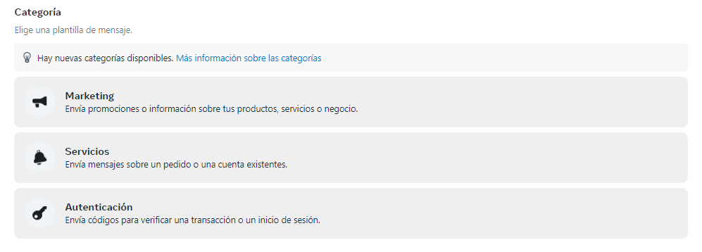
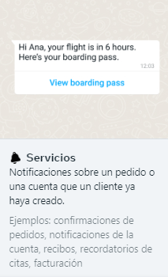
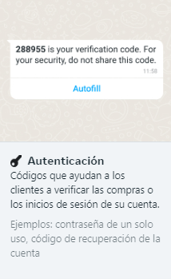
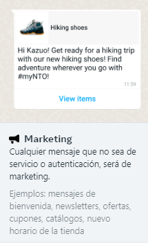
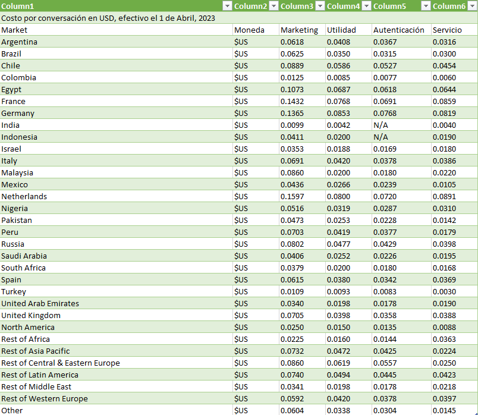
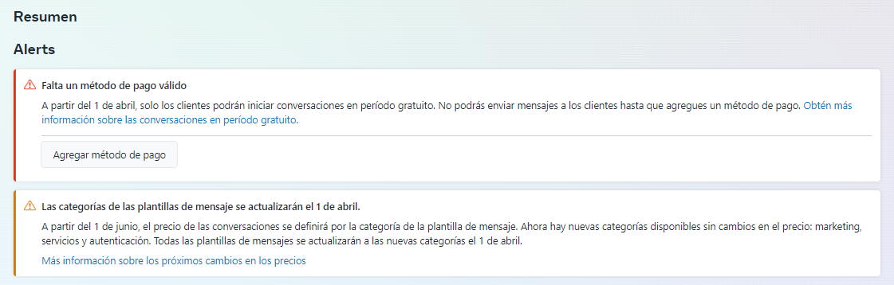

# Actualizaciones de precios basados ​​en conversaciones: WhatsApp API a partir del 1 de Abril de 2023

A las empresas que utilicen la plataforma empresarial de WhatsApp se les cobrará por conversación de 24 horas, con diferentes tarifas por categoría de conversación. Las **conversaciones iniciadas por negocios** de hoy se dividirán en tres nuevas categorías: utilidad/servicios públicos, autenticación y marketing. **Las conversaciones iniciadas por el usuario** de hoy se denominarán conversaciones de servicio.

## Categorías de conversación
**1.    Iniciadas por el Negocio:**

Hay tres categorías de conversaciones iniciadas por el negocio (todas las cuales requieren que el cliente opte por participar):

* **Conversaciones de servicios públicos/utilidad:** facilite una solicitud o transacción específica acordada o actualice a un cliente sobre una transacción en curso, incluidas las notificaciones posteriores a la compra y los resúmenes de facturación recurrentes.
- Ejemplo:

Hola Alexandra, su vuelo es en 6 horas. Aquí está su tarjeta de embarque.

* **Conversaciones de autenticación:** permite a las empresas autenticar a los usuarios con códigos de acceso de un solo uso, posiblemente en varios pasos del proceso de inicio de sesión (p. ej., verificación de cuenta, recuperación de cuenta, desafíos de integridad)
- Ejemplo: 

 **288955** es su código de verificación. Por su seguridad, no comparta este código.

 

 * **Conversaciones de marketing:** incluya promociones u ofertas, actualizaciones informativas o invitaciones para que los clientes respondan/tomen medidas. Cualquier conversación que no califique como utilidad o autenticación es una conversación de marketing.
- Ejemplo: 

Hola Lucero ¡Prepárate para un viaje de senderismo con nuestros nuevos zapatos de senderismo! ¡Encuentra aventuras donde quiera que vayas con #myNTO!.

**2.    Iniciadas por el Usuario:**

 Todas las conversaciones iniciadas por el usuario se clasificarán como **conversaciones de servicio**, que ayudan a los clientes a resolver consultas.

 Cómo se iniciarán los cargos de conversación
1.    Iniciadas por el Negocio:

* Los cargos por conversación se basarán en la categoría de la plantilla. Cuando se entrega una plantilla, se abre una nueva conversación de esa categoría y se incurre en el cargo de esa categoría de conversación, a menos que la plantilla se entregue durante una conversación abierta de esa categoría. 
 - Por ejemplo:

Si una conversación de servicios públicos está abierta y se entrega una plantilla de marketing dentro de esa conversación abierta, se abre una nueva conversación de marketing separada y se inicia el cargo de la conversación de marketing.

* Sin embargo, el envío de varias plantillas de la misma categoría dentro de una conversación abierta no generará cargos adicionales.
- Por ejemplo:

Una empresa puede enviar varias plantillas de servicios públicos en una conversación abierta de servicios públicos sin cargos adicionales.

**2.    Iniciadas por el Usuario:**

* Las conversaciones de servicio solo se iniciarán cuando no haya otra ventana de conversación abierta y una empresa responda a un usuario con un mensaje de formato libre dentro de la **[ventana de servicio al cliente de 24 horas](https://developers.facebook.com/docs/whatsapp/conversation-types#customer-service-window).**
* Si una empresa responde a un usuario con un mensaje de plantilla o envía un mensaje de plantilla en una conversación de servicio abierta, esto abre una nueva conversación basada en la categoría de plantilla.
  
La excepción a esto son las conversaciones de puntos de entrada gratuitos. Durante la ventana gratuita, las empresas pueden enviar varias plantillas de diferentes categorías y no se abrirá ninguna conversación nueva.

## Hojas de tarifas para conversaciones de servicios públicos, marketing, autenticación y servicios: a partir del 1 de Abril del 2023

Puede **[descargar](https://developers.facebook.com/docs/whatsapp/updates-to-pricing#rate-cards-for-utility--marketing-and-service-conversations--effective-june-1--2023)** las hojas de tarifas para marketing, utilidad y servicio a continuación. La hoja de tarifas para la autenticación se publicará en una fecha posterior, antes del lanzamiento del 1 de Abril.

**Tarjeta de tarifas de USD**

**
Precios en Soles - PEN
**

| Iniciada por la empresa(Marketing) 	| Iniciada por la empresa(Utilidad/Servicio) 	| Iniciada por la empresa(Autenticación) 	| Iniciada por el Cliente(Servicio) 	|
|:----------------------------------:	|:------------------------------------------:	|:--------------------------------------:	|:---------------------------------:	|
|         0.26 cent. **aprox(*)**        	|             0.16 cent. **aprox(*)**            	|           0.14 cent **aprox(*)**          	|        0.067 cent. **aprox(*)**      	|

## Cambios adicionales a los precios basados ​​en conversaciones en 2023
**1.    Cambios en las conversaciones del punto de entrada gratuito: a partir del 1 de marzo de 2023**

* Las conversaciones no se cobran cuando los usuarios envían mensajes a las empresas mediante **botones de llamada a la acción en los [anuncios que hacen clic en los botones de llamada a la acción de la página de WhatsApp](https://www.facebook.com/business/help/447934475640650)** o **[Facebook](https://www.facebook.com/help/977869848936797)** . 
* A partir del 1 de marzo, brindaremos más conversaciones gratuitas cuando los usuarios envíen mensajes a las empresas a través de estos puntos de entrada **al extender la ventana de conversación gratuita de 24 a 72 horas**.
* Cuando se abre una conversación de punto de entrada gratuito, no se puede abrir ninguna otra categoría de conversación, incluso si una empresa envía una plantilla dentro de la ventana de conversación de punto de entrada gratuito de tres días (72 horas).
* Se aplica el precio estándar para los anuncios que hacen clic en WhatsApp. **La conversación** que se inicia desde el anuncio es gratuita, pero no el anuncio en sí.

**2.    Cambios en las conversaciones de nivel gratuito: a partir del 1 de abril del 2023**

* Las empresas podrán seguir probando la plataforma empresarial de WhatsApp con **1000 conversaciones gratuitas iniciadas por el usuario cada mes.**
* Cada cuenta comercial de WhatsApp (WABA) recibirá 1,000 conversaciones gratuitas iniciadas por el usuario por mes (independientemente de la cantidad de números de teléfono adjuntos a la WABA). 
* El nivel gratuito se actualiza mensualmente según la zona horaria asociada con WABA.

:::danger IMPORTANTE: 

Las conversaciones iniciadas por empresas ya no se incluirán en el nivel gratuito(1000 conversaciones gratuitas)

:::