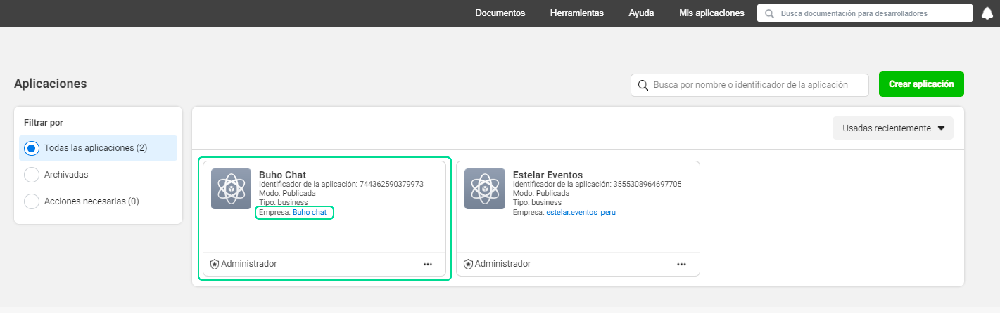
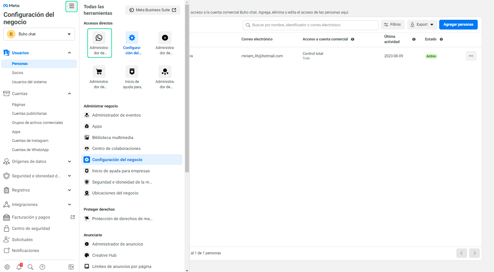
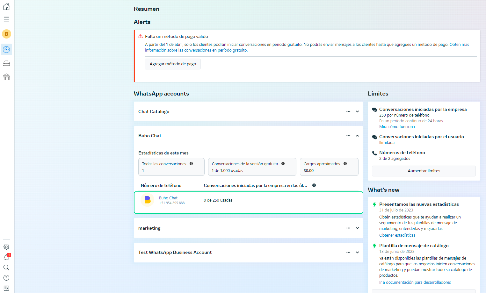
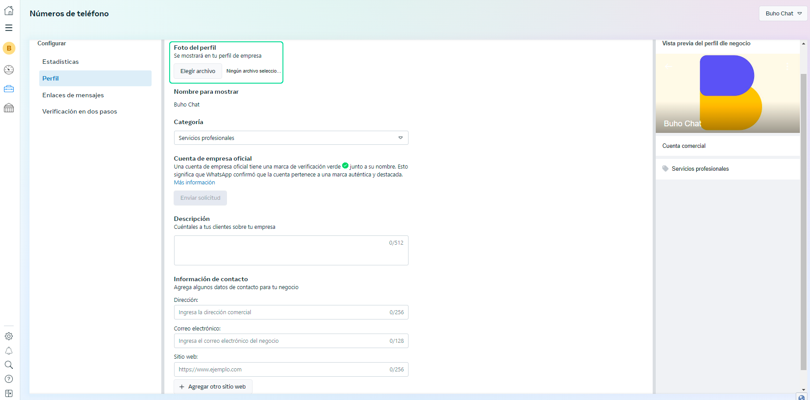

# Añadir foto de perfil

En este artículo te enseñaremos a como **añadir la foto de perfil** para la cuenta de WhatsApp API y que visualizarán todos tus clientes.

## Ingresar a Facebook Developers

Primero deberás ingresar a este link **[https://developers.facebook.com/?locale=es_ES](https://developers.facebook.com/?locale=es_ES)**, en esta área deberás ingresar a la aplicación que se creó para la integración de Whatsapp API con Chatbúho y haz click en la sección empresa, que aparece en texto azul.

Posteriormente, te dirigirá a la configuración del negocio, selecciona el ícono de herramientas y haz click en  **Administrador de WhatsApp**.

Luego visualizarás las cuentas de WhatsApp, selecciona tu cuenta y **haz click en el nombre de la cuenta**.

Después  te dirigirá a la sección de **configuración del número** o cuenta de WhatsApp API.

Selecciona **elegir archivo** y añade tu foto de perfil empresarial, asimismo también puedes añadir mayor descripción y otros datos relacionados de tu empresa. Finalmente selecciona el botón de **Guardar** y los clientes podrán la foto de perfil empresarial.

