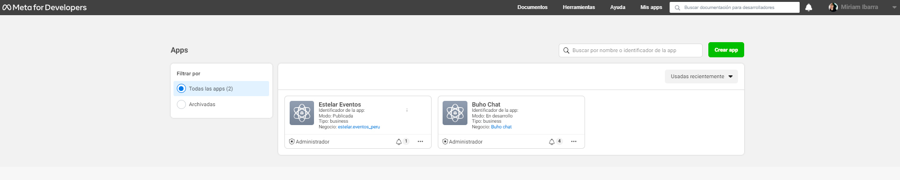
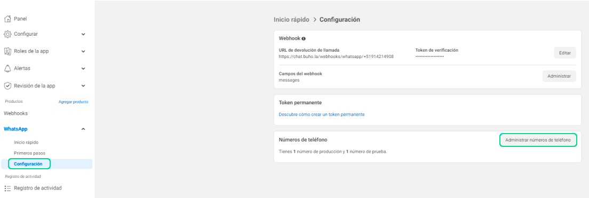
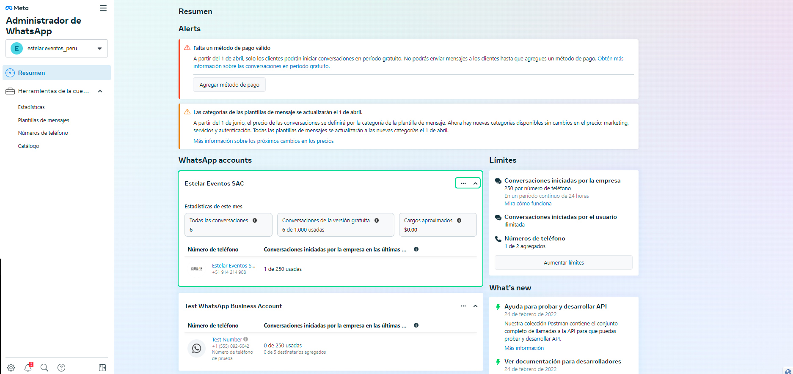
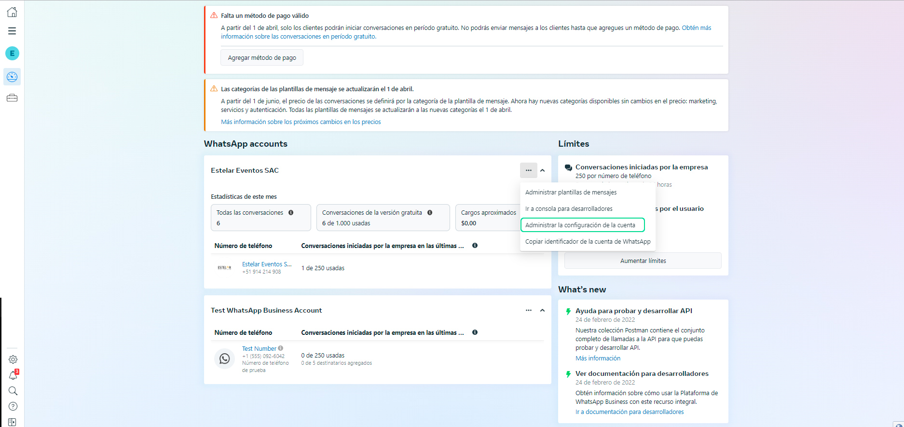
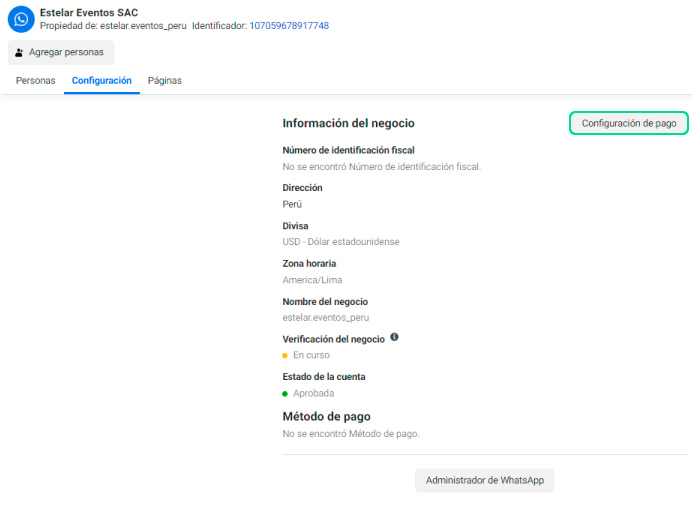
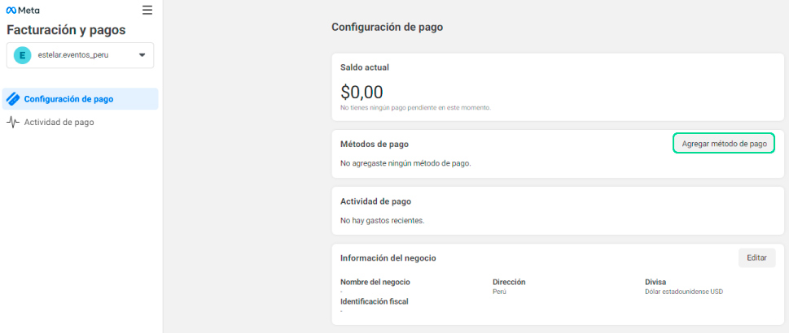
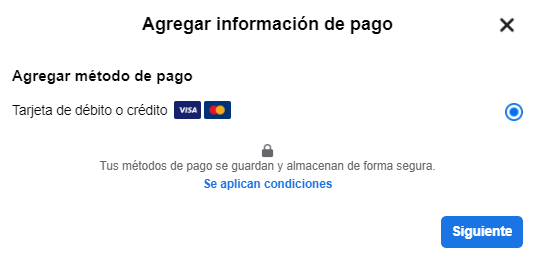
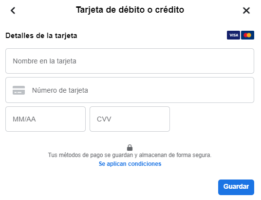

# Cómo agregar una tarjeta de crédito o débito a la plataforma de WhatsApp Business

En este artículo aprenderás cómo añadir método de pago a tu cuenta de WhatsApp API.

## ¿Porqué debo configurar mi método de pago?
Anteriormente WhatsApp API brindaba las primeras 1.000 conversaciones gratuitas por mes, aplicaba cuando el cliente o la empresa iniciaban una conversación. Actualmente, debido a las nuevas modificaciones en las políticas de Facebook, **las conversaciones iniciadas por la empresa ya no se incluirán en el nivel gratuito**. Debido a ello, sugerimos **configuren su método de pago dentro de su cuenta de WhatsApp API**, corroborando que a partir del 1 de abril, solo los clientes podrán iniciar conversaciones en período gratuito.

:::danger IMPORTANTE:

Si tu negocio no tiene método de pago, solo podrás contestar las conversaciones que sean generadas por parte del cliente, sin embargo, la empresa no podrá iniciar ninguna conversación.

:::

Puede pagar la mensajería con una **tarjeta de crédito o débito** a través de Visa o Mastercard. El método de pago con tarjeta de crédito o débito, está disponible si se encuentra en uno de los **[países admitidos](https://www.facebook.com/business/help/419761233006366)**.

Planeamos admitir países y métodos de pago adicionales pronto. Las monedas admitidas actualmente incluyen: AUD, EUR, IDR, INR, GBP y USD.

## Ingresa Facebook Developer
1. Para configurar tu método de pago, deberás ingresar a **[Facebook developer](https://developers.facebook.com/?locale=es_ES)**, luego visualizarás la página de Facebook Developers y se ingresará a **My Apps / Mis aplicaciones**, previamente tienes que iniciar sesión en tu cuenta de Facebook, donde administras todas las configuraciones generales.

2. Luego selecciona el **app** que se creó para la integración del número de WhatsApp API con la plataforma de mensajería de ChatBúho. 

3. Después dirígete al módulo de WhatsApp, seleccione la pestaña **Configuración** y luego **Administrar números de teléfono.** Este paso lo llevará a Business Manager, donde puede agregar una tarjeta de crédito a su cuenta de WhatsApp Business.

:::info NOTA:
Debe tener asignado el permiso Administrar cuenta de WhatsApp para agregar una tarjeta de crédito a la cuenta de WhatsApp Business. Si posee la cuenta de WhatsApp Business, tiene el permiso automáticamente.

:::

## Agregue una tarjeta de crédito a su cuenta de WhatsApp Business
Para agregar una tarjeta de créditoo debito a su cuenta de WhatsApp Business Platform:

1. En **Business Manager**, ve a la **[WhatsApp Accounts o Cuentas de WhatsApp](https://business.facebook.com/wa/manage/home/)**

2. Seleccione la cuenta de WhatsAPP relacionado al número que utilizó para la integración con ChatBúho, seleccione el ícono de 3 puntos.

3. Haz clic en **Administrar la configuración de la cuenta.**

4. En la pestaña Configuración, haga clic en **Configuración de pago.**

5. En la configuración de pago, haga clic en **Agregar método de pago.**

6. Siga las instrucciones para agregar su información de pago y haga clic en **Siguiente.**

7. Agregue los detalles de su tarjeta y haga clic en **Guardar**.

8. Siga las instrucciones para agregar la información de su empresa y haga clic en **Guardar.**

9. La tarjeta de crédito se agrega a su cuenta de la plataforma de WhatsApp Business. Puede ver la tarjeta de crédito agregada en la pestaña **Configuración.**

