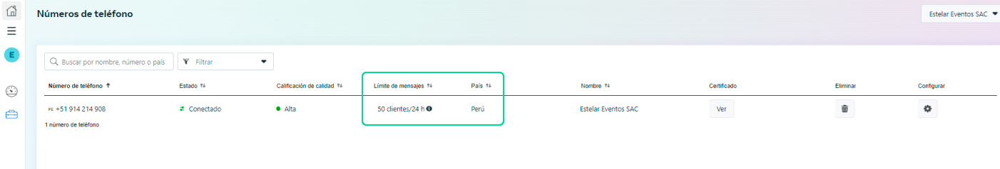
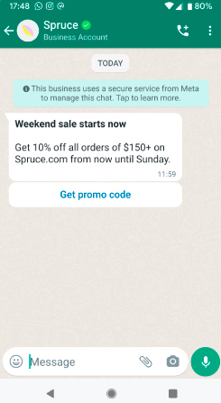

# Diferencias sobre Verificación del negocio VS Cuenta de empresa oficial

   ## 1. Verificación del negocio:
La verificación del negocio es un proceso que permite comprobar **tu empresa como entidad legal**, además, cumple la función de una prueba de asociación con tu negocio, para certificar que eres un representante oficial del mismo.

Asimismo tu empresa debe estar registrada ante las autoridades locales y tener un número de teléfono y una dirección postal oficiales.

Probablemente estás en este artículo porque Facebook ha determinado que tu empresa **[debe verificar tu cuenta de Facebook Business Manager](https://www.facebook.com/business/help/2058515294227817?id=180505742745347)** para aumentar los límites de mensajería de tu **[cuenta de la API WhatsApp Business](https://buho.la/ayuda/productos/chat-buho/que-es-whatsapp-api-precios-y-requisitos)**.

**Verificación de empresas de Facebook para WhatsApp Business API:**

:::info
A partir del 2 de mayo de 2022, las empresas que se suscriban a la WhatsApp Business API ya no tendrán que pasar por la verificación de Facebook Business, quiere decir la revisión del nombre para mostrar en la fanpage y las comprobaciones de la política comercial.
:::

En su lugar, se añadirán al nivel de **acceso limitado**, en el que se activará automáticamente una comprobación de conformidad con la política de la **plataforma WhatsApp** , que se llevará a cabo en segundo plano, lo que permitirá a las empresas enviar mensajes a sus clientes inmediatamente después de registrarse.

En el nivel de acceso limitado, las empresas pueden:

* Enviar hasta **50 mensajes** iniciados por la empresa en un periodo de 24 horas consecutivas por número de teléfono.
* Responder a un número ilimitado de conversaciones iniciadas por los clientes en un plazo de 24 horas de mensajería.
* Registrar hasta 2 número.

Para iniciar con la verificación de tu cuenta comercial, ingresa **[aquí](/docs/whatsapp-api-facebook/Pasos-para-la-verificaci%C3%B3n-del-negocio-y-requisitos.md)**.

## 2.  Cuenta de empresa oficial:
Si tu cuenta de WhatsApp es una cuenta de empresa oficial, se **incluirá una marca de verificación verde** al lado del nombre que se muestra en la vista de contactos.

**¿Cómo funciona y cuáles son los requisitos?**

:::info RECUERDA:
Que Facebook - Meta brindará el check verde a la cuenta de una marca **relevante y auténtica.**

:::

 Además de cumplir con las políticas de **[comercio](https://l.facebook.com/l.php?u=https%3A%2F%2Fwww.whatsapp.com%2Flegal%2Fcommerce-policy%2F&h=AT1g5D-lm4zr5y8_6xyZ5O8unl8AS90Jb6EvY0HJCMsZujH3SrKcBXGeY313Ez_P_RmLwMKSoCxLof_t2difQ6XzrC_Cz0Ihttjuorfm3AMHPIXmTy-oO8RrMF-BvDuti6rkx6AkMK--SdxVJWFpiQ)** y **[empresariales](https://l.facebook.com/l.php?u=https%3A%2F%2Fwww.whatsapp.com%2Flegal%2Fbusiness-policy&h=AT3EXrfk309CoLe-DIwGnDfdOVM6BmXFtlP8h-_g00T92V6TSf8iukBBWx2ShEepkLjfozAfN0zHnFe70tWA4_ii9F3myLdn-XZPFG9UB_A9wSz23VDh5BAgvqh2hZx3VoC7INNgpqhe-K7si9YuloDNs-ie6DrrLYw)** de WhatsApp, las empresas deben cumplir con lo siguiente:

* **[Ser relevantes:](https://developers.facebook.com/docs/whatsapp/overview/business-accounts/#notability)** tienen que representar a una empresa o entidad conocida y buscada.
* **Estar verificados:** deben someterse a **[verificaciones de negocios](https://www.facebook.com/business/help/2058515294227817?id=180505742745347)**.
* **2FA:** deben tener establecida la **[verificación en dos pasos](https://developers.facebook.com/docs/whatsapp/api/settings/two-step-verification)**.

