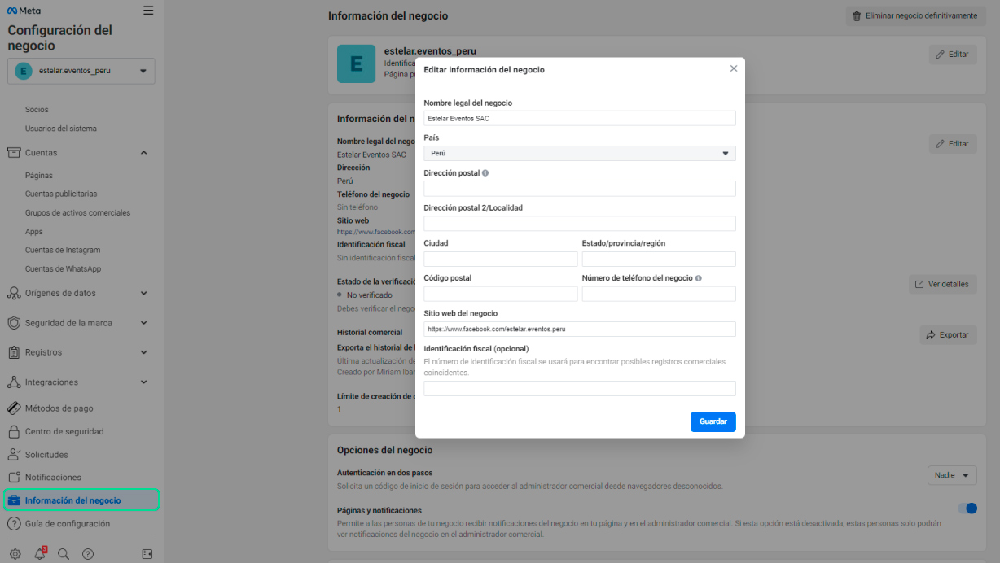
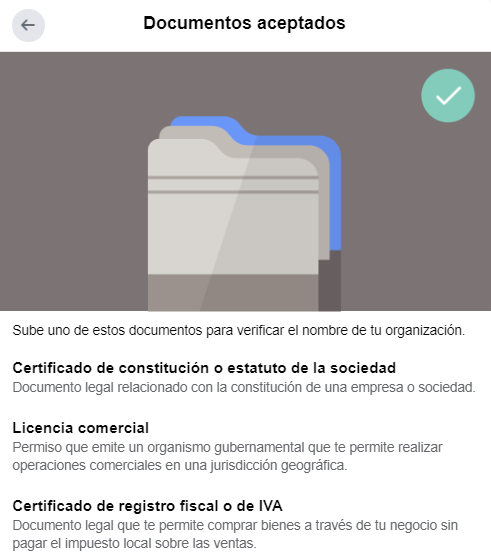
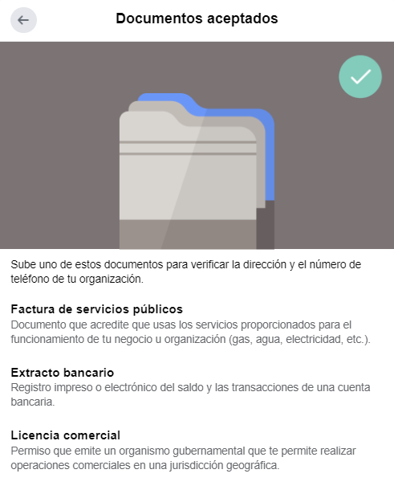
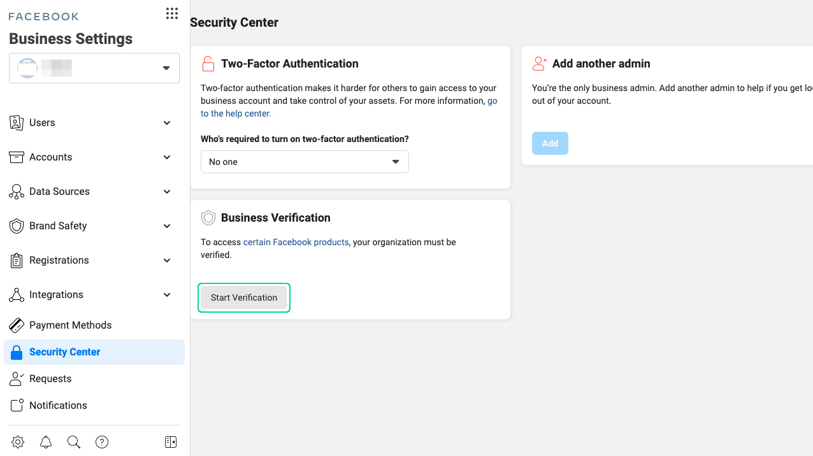
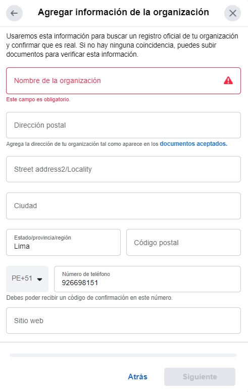
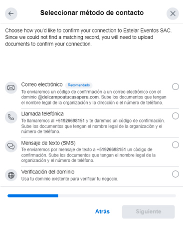
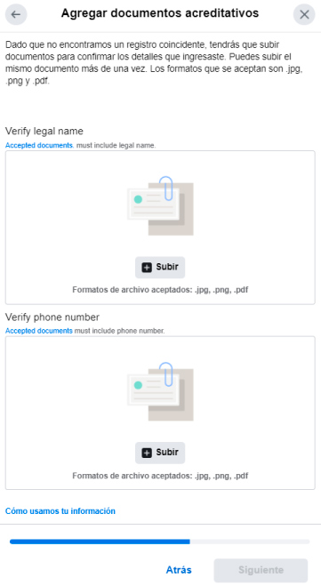
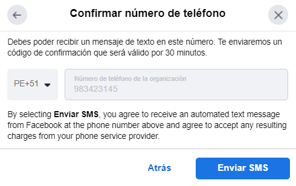
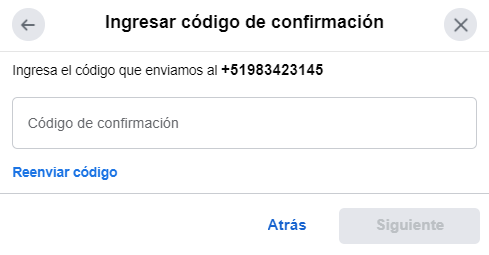

# Pasos para la verificación del negocio y requisitos

## Requisitos de verificación del administrador de empresas de Facebook
Antes de iniciar el proceso de verificación, tienes que rellenar la sección de información de la empresa de tu administrador de empresas de Facebook. En esta sección, tienes que proporcionar detalles de la organización como el nombre legal, la dirección, el número de teléfono, la dirección de correo electrónico y el sitio web.

**Asegúrate de que la información proporcionada coincide con los datos registrados ante las autoridades locales.** Mientras Facebook pueda verificar tu organización a partir de la información proporcionada, no es necesario proporcionar documentos de apoyo para la verificación.

Si Facebook no puede identificar tu empresa, tienes que demostrar los siguientes datos legales con los documentos adecuados:

* **Nombre legal de la empresa:** Licencia comercial, certificado de constitución o certificado de registro fiscal o de IVA.

* **Dirección y número de teléfono de la organización:** Factura de servicios públicos, extracto bancario o licencia comercial con su dirección y número de teléfono.

Después de presentar los documentos, tiene que pasar por la autenticación de dos factores para demostrar que tiene acceso al teléfono o al correo electrónico de su empresa. Es posible que también tenga que proporcionar sus datos personales para verificar su empresa en algunos casos.

No proporciones información falsa, no verifiques negocios que no estás autorizado a representar ni eludas el sistema de revisión de verificación. Estas acciones harán que Facebook rechace tu solicitud de verificación e incluso tome medidas adicionales contra tu cuenta.

## Cómo verificar Meta Business Manager: WhatsApp Business API
Ahora que tienes la **información de tu empresa rellenada** y los **documentos de apoyo listos**, vamos a verificar tu cuenta de Meta Business Manager.

1. Ve a la **Configuración de empresas de Facebook** y ve al **Centro de seguridad**. Podrás ver la opción de verificación de empresas una vez que te hayas registrado en WhatsApp Business API. Selecciona el botón **Iniciar verificación**. 

2. **Añada** los datos de su organización. Si ha rellenado los datos de su empresa en la sección de información empresarial, esta sección se rellenará automáticamente. Compruebe dos veces la información para asegurarse de que es correcta.

3. **Selecciona** tu método de contacto preferido para recibir un código de confirmación para verificar tu cuenta de Facebook Business Manager. Si has verificado tu dominio, puedes enviar tu solicitud de inmediato, sin tener que recibir un código de confirmación.

4. **Añada** los documentos justificativos para demostrar los datos legales de su empresa y envíelos.

5. **Confirma** tu número de teléfono y haz clic en **Enviar SMS** para obtener un código de confirmación. Este paso depende del método de contacto que hayas seleccionado en el paso anterior.

6. **Introduzca el código de confirmación** y haga clic en **Siguiente**. Si no ha recibido un código de verificación, haga clic en **Reenviar código.** También puede cambiar su método de contacto preferido si el método elegido no funciona.

## ¿Cuánto tiempo dura la verificación de la empresa en Facebook?
Una vez que hayas completado el proceso de verificación, recibirás tu **estado de verificación por correo electrónico** y **por Facebook en un plazo de 2 a 3 días laborables.** También puedes comprobar el estado en la sección Información de la empresa o en el Centro de seguridad de tu administrador de empresas de Facebook.

Si Facebook no concede a tu empresa el estatus de verificada, puedes apelar su decisión presentando documentos adicionales para confirmar los datos de tu empresa. En este caso, Facebook te pedirá tu **DNI** y otros dos documentos de apoyo a su discreción.

Asegúrate de mostrar toda la información de tu documento de identidad y las cuatro esquinas del mismo. Mantén el documento de identidad plano y utiliza un fondo oscuro para la foto. Ten en cuenta que Facebook no aceptará imágenes que hayan sido modificadas digitalmente.

Si sigue teniendo problemas con el proceso de verificación, puede deberse a que su presentación está incompleta, a que los documentos no se pueden ver, a que los datos de la empresa en los documentos legales no coinciden con los datos que usted proporcionó o a otras cosas.

:::info RECUERDA:
* La verificación del negocio difiere de la **[insignia verificada](https://www.facebook.com/help/1288173394636262)**, la confirmación de identidad personal y la insignia verificada en Instagram. No recibirás una insignia de cuenta verificada por verificar tu negocio.

 * Meta impedirá la verificación de tu negocio, eliminará el estado de verificación de tu negocio o tomará más medidas con tu cuenta si brindas información falsa o engañosa durante el proceso de verificación, intentas reclamar responsabilidad y verificar un negocio que no estás autorizado a representar o tratas de evitar nuestros sistemas de revisión de verificaciones.

:::